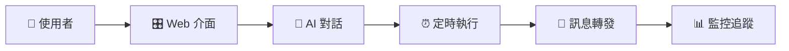
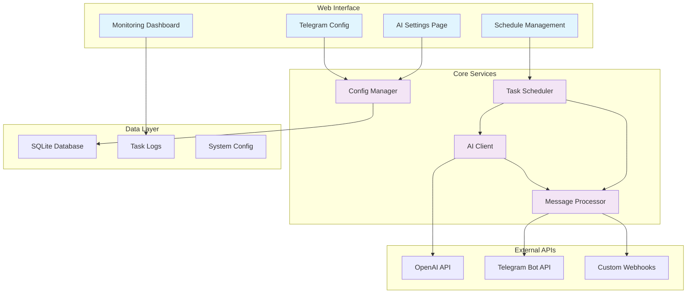
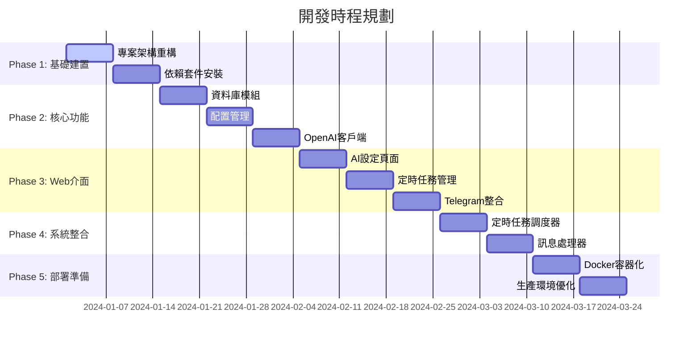

# Daily Message Service

<div align="center">


**🤖 智能定時訊息服務 | 🎛️ Web 管理介面 | 🐳 Docker 部署**

</div>

---

一個定時向 OpenAI API 發送訊息並轉發到指定 POST API 的智能服務，具備完整的 Web 設定介面和 Docker 支援。

## 📖 目錄

<details>
<summary>🔍 點擊展開完整目錄</summary>

- [📋 專案概述](#-專案概述)
- [🟢 當前狀況](#-當前狀況)
- [🔮 功能規劃](#-功能規劃)
- [🤝 參與開發](#-參與開發)

</details>

## 📋 專案概述

### 🎯 核心願景
打造一個簡單易用的自動化訊息服務，讓使用者能夠：



- ✨ 透過直覺的 Web 介面管理 AI 對話設定
- ⚡ 設定定時任務自動獲取 AI 回應
- 🚀 將 AI 生成的內容自動轉發到 Telegram 或其他平台
- 🐳 享受完全容器化的部署體驗

### 🛠️ 技術棧

<table>
<tr>
<td>

**已實現 ✅**
- Next.js 15.4.2
- React 19.1.0
- TypeScript 5
- Tailwind CSS 4

</td>
<td>

**規劃中 🔄**
- SQLite + better-sqlite3
- node-cron
- OpenAI SDK
- Docker

</td>
</tr>
</table>

---

## 🟢 當前狀況

### ✅ 已實現功能
- [x] **基礎專案架構** - Next.js + TypeScript + Tailwind CSS
- [x] **開發環境配置** - 支援 Turbopack 快速開發
- [x] **響應式設計基礎** - Tailwind CSS 4 整合

### 📁 當前專案結構
```
daily-message/
├── src/
│   ├── app/
│   │   ├── favicon.ico
│   │   ├── globals.css          # 全域樣式
│   │   ├── layout.tsx           # 應用程式佈局
│   │   └── page.tsx             # 首頁 (Next.js 預設)
│   └── (其他目錄待建立)
├── public/                      # 靜態資源
├── package.json                 # 專案依賴
├── tsconfig.json               # TypeScript 配置
├── next.config.ts              # Next.js 配置
├── postcss.config.mjs          # PostCSS 配置
└── README.md                   # 專案說明
```

### 🚀 快速開始

#### 本地開發
```bash
# 1. 安裝依賴
npm install

# 2. 啟動開發伺服器 (使用 Turbopack)
npm run dev

# 3. 開啟瀏覽器
# http://localhost:3000
```

#### 可用腳本
```bash
npm run dev      # 啟動開發伺服器 (Turbopack)
npm run build    # 建置生產版本
npm run start    # 啟動生產伺服器
npm run lint     # 執行程式碼檢查
```

### 📦 當前依賴
```json
{
  "dependencies": {
    "react": "19.1.0",
    "react-dom": "19.1.0", 
    "next": "15.4.2"
  },
  "devDependencies": {
    "typescript": "^5",
    "@types/node": "^20",
    "@types/react": "^19",
    "@types/react-dom": "^19",
    "@tailwindcss/postcss": "^4",
    "tailwindcss": "^4"
  }
}
```

---

## 🔮 功能規劃

### 🎯 核心功能設計

#### 1. 🤖 AI 整合模組
- **OpenAI API 客戶端** - 支援自定義端點和模型選擇
- **對話管理** - 訊息模板和上下文管理
- **錯誤處理** - 重試機制和降級策略
- **即時測試** - API 連線驗證功能

#### 2. ⏰ 定時任務系統
- **Cron 調度器** - 靈活的時間設定
- **任務佇列** - 可靠的任務執行
- **執行日誌** - 完整的執行記錄
- **狀態監控** - 即時任務狀態追蹤

#### 3. 🎛️ Web 管理介面
- **AI 設定頁面** - API 配置和模型選擇
- **定時任務管理** - 視覺化 Cron 設定
- **Telegram 整合** - Bot 配置和測試
- **執行監控** - 日誌查看和狀態監控

#### 4. 📱 外部整合
- **Telegram Bot API** - 訊息自動轉發
- **Webhook 支援** - 通用 POST API 整合
- **訊息模板** - 支援變數替換
- **多平台支援** - 可擴展的輸出介面

### 🏗️ 系統架構設計



### 📋 開發路線圖

<div align="center">

**整體進度: 10% 完成**


</div>



#### 🏗️ Phase 1: 基礎建置 (Week 1-2)

<details>
<summary><strong>📁 專案架構重構</strong> - 預估 8 小時</summary>

- [ ] 建立 `src/lib/` 核心模組目錄
- [ ] 建立 `src/components/` UI 元件目錄
- [ ] 建立 `src/app/api/` API 路由結構
- [ ] 建立 `data/` 資料庫目錄

</details>

<details>
<summary><strong>📦 依賴套件安裝</strong> - 預估 4 小時</summary>

| 套件 | 用途 | 版本 | 狀態 |
|------|------|------|------|
| `better-sqlite3` | SQLite 資料庫 | ^9.0.0 | ⏳ 待安裝 |
| `node-cron` | 定時任務 | ^3.0.3 | ⏳ 待安裝 |
| `openai` | OpenAI API | ^4.0.0 | ⏳ 待安裝 |
| `axios` | HTTP 客戶端 | ^1.6.0 | ⏳ 待安裝 |
| `zod` | 表單驗證 | ^3.22.0 | ⏳ 待安裝 |

</details>

#### Phase 2: 核心功能開發 (Week 3-4)
- [ ] **資料庫模組** (`src/lib/db.ts`)
  - [ ] SQLite 連線管理
  - [ ] 資料表結構設計
  - [ ] CRUD 操作封裝

- [ ] **配置管理** (`src/lib/config.ts`)
  - [ ] 系統配置讀寫
  - [ ] 配置驗證邏輯
  - [ ] 預設值管理

- [ ] **OpenAI 客戶端** (`src/lib/openai.ts`)
  - [ ] API 客戶端封裝
  - [ ] 錯誤處理機制
  - [ ] 重試邏輯實現

#### Phase 3: Web 介面開發 (Week 5-6)
- [ ] **AI 設定頁面** (`src/app/settings/ai/`)
  - [ ] API 配置表單
  - [ ] 即時連線測試
  - [ ] 模型選擇介面

- [ ] **定時任務管理** (`src/app/settings/schedule/`)
  - [ ] Cron 表達式編輯器
  - [ ] 任務狀態顯示
  - [ ] 執行歷史查看

- [ ] **Telegram 整合** (`src/app/settings/telegram/`)
  - [ ] Bot 配置介面
  - [ ] 訊息模板編輯
  - [ ] 測試發送功能

#### Phase 4: 系統整合 (Week 7-8)
- [ ] **定時任務調度器** (`src/lib/scheduler.ts`)
  - [ ] Cron 任務管理
  - [ ] 任務執行邏輯
  - [ ] 錯誤處理和日誌

- [ ] **訊息處理器** (`src/lib/message-processor.ts`)
  - [ ] AI 回應處理
  - [ ] 模板變數替換
  - [ ] 外部 API 發送

#### Phase 5: 部署準備 (Week 9-10)
- [ ] **Docker 容器化**
  - [ ] Dockerfile 編寫
  - [ ] docker-compose.yml 配置
  - [ ] 環境變數管理

- [ ] **生產環境優化**
  - [ ] 效能調優
  - [ ] 錯誤監控
  - [ ] 日誌管理

### 📊 預期功能清單

| 功能模組 | 優先級 | 預估工時 | 狀態 |
|---------|--------|----------|------|
| 專案架構重構 | 🔴 高 | 8h | ⏳ 待開始 |
| SQLite 資料庫 | 🔴 高 | 12h | ⏳ 待開始 |
| OpenAI 整合 | 🔴 高 | 16h | ⏳ 待開始 |
| Web 設定介面 | 🟡 中 | 24h | ⏳ 待開始 |
| 定時任務系統 | 🟡 中 | 20h | ⏳ 待開始 |
| Telegram 整合 | 🟡 中 | 16h | ⏳ 待開始 |
| Docker 部署 | 🟢 低 | 8h | ⏳ 待開始 |
| 監控和日誌 | 🟢 低 | 12h | ⏳ 待開始 |

### 🔧 規劃中的 API 設計

#### 配置管理 API
```typescript
// GET /api/config - 獲取所有配置
// PUT /api/config - 更新配置
// POST /api/config/test - 測試 AI 連線
// POST /api/config/validate-cron - 驗證 Cron 表達式
```

#### 任務管理 API
```typescript
// GET /api/tasks - 獲取任務列表
// POST /api/tasks - 創建新任務
// PUT /api/tasks/:id - 更新任務
// DELETE /api/tasks/:id - 刪除任務
// POST /api/tasks/:id/run - 手動執行任務
```

#### 日誌查詢 API
```typescript
// GET /api/logs - 獲取執行日誌
// GET /api/logs/latest - 獲取最新日誌
// GET /api/logs/:taskId - 獲取特定任務日誌
```

---

## 🤝 參與開發

### 🛠️ 開發環境需求

<table>
<tr>
<th>🔧 必需工具</th>
<th>📋 版本要求</th>
<th>📝 安裝說明</th>
</tr>
<tr>
<td>Node.js</td>
<td>18.0.0+</td>
<td><a href="https://nodejs.org/">官方下載</a></td>
</tr>
<tr>
<td>npm</td>
<td>9.0.0+</td>
<td>隨 Node.js 安裝</td>
</tr>
<tr>
<td>Git</td>
<td>2.30.0+</td>
<td><a href="https://git-scm.com/">官方下載</a></td>
</tr>
<tr>
<td>VS Code</td>
<td>最新版 (推薦)</td>
<td><a href="https://code.visualstudio.com/">官方下載</a></td>
</tr>
</table>

### 🚀 快速開始開發

```bash
# 1. 複製專案
git clone https://github.com/your-username/daily-message.git
cd daily-message

# 2. 安裝依賴
npm install

# 3. 啟動開發伺服器
npm run dev

# 4. 在瀏覽器中開啟
# http://localhost:3000
```

### 📝 貢獻流程

```mermaid
gitgraph
    commit id: "main分支"
    branch feature/new-feature
    checkout feature/new-feature
    commit id: "開發新功能"
    commit id: "添加測試"
    commit id: "更新文件"
    checkout main
    merge feature/new-feature
    commit id: "合併功能"
```

#### 詳細步驟

1. **🍴 Fork 專案** - 點擊右上角的 Fork 按鈕
2. **📥 複製到本機**
   ```bash
   git clone https://github.com/your-username/daily-message.git
   ```
3. **🌿 創建功能分支**
   ```bash
   git checkout -b feature/amazing-feature
   ```
4. **💻 開發新功能** - 遵循我們的開發規範
5. **✨ 提交變更**
   ```bash
   git add .
   git commit -m "feat: add amazing feature"
   ```
6. **📤 推送分支**
   ```bash
   git push origin feature/amazing-feature
   ```
7. **🔄 開啟 Pull Request** - 在 GitHub 上提交 PR

### 📐 開發規範

#### 🏗️ 專案結構規範
```
src/
├── app/                    # Next.js App Router
│   ├── api/               # API 端點
│   ├── settings/          # 設定頁面
│   └── globals.css        # 全域樣式
├── components/            # 可重用元件
│   ├── ui/               # 基礎 UI 元件
│   └── settings/         # 設定相關元件
├── lib/                  # 核心工具庫
│   ├── db.ts            # 資料庫操作
│   ├── config.ts        # 配置管理
│   └── utils.ts         # 工具函數
└── types/               # TypeScript 型別定義
```

#### 🎨 程式碼風格
- **TypeScript**: 嚴格模式，完整類型標註
- **函數命名**: 使用 camelCase
- **元件命名**: 使用 PascalCase
- **文件命名**: 使用 kebab-case
- **提交訊息**: 遵循 [Conventional Commits](https://www.conventionalcommits.org/)

#### 🧪 測試要求
```bash
# 執行測試
npm run test

# 生成覆蓋率報告
npm run test:coverage

# 型別檢查
npm run type-check
```

### 🎯 開發重點

<table>
<tr>
<td>

**🔍 程式碼品質**
- TypeScript 嚴格模式
- ESLint + Prettier
- 單元測試覆蓋率 > 80%
- 程式碼審查必通過

</td>
<td>

**🎨 使用者體驗**
- 響應式設計
- 無障礙支援 (a11y)
- 載入狀態指示
- 錯誤處理友善

</td>
</tr>
<tr>
<td>

**⚡ 效能優化**
- 程式碼分割
- 圖片最佳化
- 快取策略
- 懶載入實現

</td>
<td>

**🔐 安全性**
- 輸入驗證
- CSRF 防護
- API 金鑰保護
- 敏感資料加密

</td>
</tr>
</table>

### 🐛 問題回報

如果您發現任何問題，請在 [Issues](../../issues) 頁面提交報告：

#### 🔍 回報格式
```markdown
## 🐛 Bug 描述
簡潔描述遇到的問題

## 🔄 重現步驟
1. 前往 '...'
2. 點擊 '....'
3. 滾動到 '....'
4. 看到錯誤

## 💭 預期行為
描述您預期應該發生的情況

## 📱 環境資訊
- OS: [e.g. Windows 11]
- Browser: [e.g. Chrome 120]
- Node.js: [e.g. 18.17.0]

## 📸 截圖
如果適用，請添加截圖
```

### 💬 獲得協助

- **💬 討論**: [GitHub Discussions](../../discussions)
- **📧 聯繫**: project@example.com
- **📖 文件**: [Wiki 頁面](../../wiki)

---

## 📄 授權

本專案採用 MIT 授權 - 詳見 [LICENSE](LICENSE) 檔案

---

## 🔗 相關連結

- [Next.js 文件](https://nextjs.org/docs)
- [TypeScript 文件](https://www.typescriptlang.org/docs/)
- [Tailwind CSS 文件](https://tailwindcss.com/docs)
- [OpenAI API 文件](https://platform.openai.com/docs)

---

<div align="center">

**⭐ 如果這個專案對您有幫助，請給我們一個星星！**

Made with ❤️ by the Daily Message Team

</div>